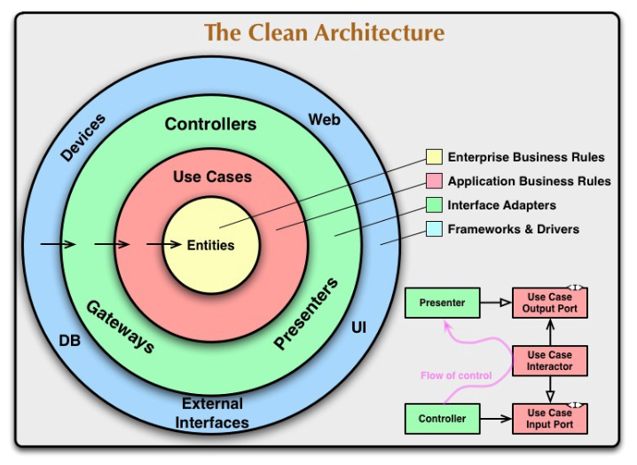

# GO-microservice-clean-architecture

This repository contains the code for the BookNow Authentication Service, which demonstrates the implementation of the Clean Architecture principles.

## Table of Contents

- [Introduction](#introduction)
- [Folder Structure](#folder-structure)
- [Visualization](#Visualization)
- [Installation](#installation)
- [Folder Structure Creation Commands](#Folder-Structure-Creation-Commands)
- [Contributing](#contributing)
- [License](#license)

## Introduction

The BookNow Authentication Service is a simple API designed to handle user registration using the Clean Architecture principles. It provides registration functionality and stores user data in a PostgreSQL database. The project utilizes the Wire framework for dependency injection, Gin for the server framework, and Gorm as the ORM for interacting with the database.

The Clean Architecture principles are followed to ensure a separation of concerns and maintainability of the codebase. The project's folder structure and code organization demonstrate how to implement the Clean Architecture concepts in a practical scenario.

By studying this project, you can learn about the usage of various technologies, including Wire, Gin, and Gorm, in the context of building a clean and maintainable API. You can explore the different components of the project, such as request handlers, middleware, repositories, and use cases, to understand how they interact with each other and contribute to the overall architecture.

Feel free to explore the code and customize it according to your needs. The provided folder structure, along with the accompanying README file, serves as a guide to help you understand the project's organization and how the different components fit together.

## Folder Structure

The repository's folder structure is organized as follows:

```bash
Clean-Architecture/
├── cmd/
│   ├── docs/
│   │   ├── docs.go
│   │   ├── swagger.json
│   │   └── swagger.yaml
│   └── main.go
├── docs/
├── Dockerfile
├── docker-compose.yml
├── Makefile
├── pkg/
│   ├── api/
│   │   ├── handler/
│   │   │   └── userHandler.go
│   │   ├── middleware/
│   │   │   └── middleware.go
│   │   ├── middleware.go
│   │   └── server.go
│   ├── config/
│   │   └── config.go
│   ├── db/
│   │   ├── connection.go
│   │   └── connectGorm.go
│   ├── di/
│   │   └── wire.go
│   ├── domain/
│   │   ├── jwtClaimsModel.go
│   │   └── user.go
│   ├── mock/
│   ├── repository/
│   │   ├── interface/
│   │   │   └── userRepoInterface.go
│   │   └── userRepository.go
│   ├── response/
│   │   └── commonResponse.go
│   ├── usecase/
│   │   ├── interface/
│   │   │   └── userUsecaseInterface.go
│   │   └── userUsecase.go
│   └── utils/
│       └── utils.go
├── README.md
└── .gitignore
```

The main components of the architecture are located in the `pkg` folder. Here's a brief overview of each folder:

- `cmd`: Contains the main application entry point and Swagger documentation files.
- `docs`: Holds additional documentation related to the service.
- `pkg/api`: Defines API-related components such as request handlers and middleware.
- `pkg/config`: Provides configuration functionality for the service.
- `pkg/db`: Contains database-related code, including connection setup.
- `pkg/di`: Contains dependency injection configuration using Wire.
- `pkg/domain`: Defines domain models used within the application.
- `pkg/mock`: Contains mock implementations used for testing.
- `pkg/repository`: Implements the repository pattern to handle data persistence.
- `pkg/response`: Defines common response structures used in the service.
- `pkg/usecase`: Implements the application-specific use cases.
- `pkg/utils`: Contains utility functions used throughout the service.
- `README.md`: This file you're currently reading.
- `.gitignore`: Specifies files and folders to be ignored by Git.

## Visualization

Visualize the Clean Architecture in Go with the following graphical representation:
<br>



```bash
   +----------------+
   |    Controller  |
   +----------------+
           |
           ↓
   +----------------+
   |    Use Case    |
   +----------------+
           |
           ↓
   +----------------+
   |  Repository   |
   +----------------+
           |
           ↓
   +----------------+
   |     Domain     |
   +----------------+

```

In this representation, the four layers are arranged in a top-down manner, with each layer depending on the layer below it. Here's a brief description of each layer:

1. Controller: This layer represents the outermost layer and is responsible for handling external inputs such as HTTP requests or 
   command-line inputs. It receives the input and invokes the appropriate use case(s) to process the request.
2. Use Case: The use case layer contains the application-specific business logic. It represents the high-level actions or operations of
   the application. Use cases coordinate the interaction between the controller, repository, and domain layers to fulfill the requested operation.
3. Repository: The repository layer abstracts the data access and storage operations. It defines an interface that specifies the 
   methods for interacting with the underlying data storage (e.g., a database). The concrete implementation of the repository is typically provided in an external package or module.
4. Domain: The domain layer represents the core business entities and rules. It contains the essential business logic and data 
   structures of the application. The entities in this layer are independent of any external dependencies and frameworks.


## Installation

To install and set up the BookNow Authentication Service, follow these steps:

1. Clone the repository: `git clone https://github.com/athunlal/GO-microservice-clean-architecture.git`
2. Change into the project directory: `cd GO-microservice-clean-architecture`

## Folder Structure Creation Commands

If you're creating the folder structure manually, you can use the following commands:

```bash
mkdir -p cleanArchitectureDemo/cmd/docs
mkdir -p cleanArchitectureDemo/pkg/api/handler
mkdir -p cleanArchitectureDemo/pkg/api/middleware
mkdir -p cleanArchitectureDemo/pkg/config
mkdir -p cleanArchitectureDemo/pkg/db
mkdir -p cleanArchitectureDemo/pkg/di
mkdir -p cleanArchitectureDemo/pkg/domain
mkdir -p cleanArchitectureDemo/pkg/mock
mkdir -p cleanArchitectureDemo/pkg/repository/interface
mkdir -p cleanArchitectureDemo/pkg/response
mkdir -p cleanArchitectureDemo/pkg/usecase/interface
mkdir -p cleanArchitectureDemo/pkg/utils

mkdir -p GO-microservice-clean-architecture/cmd/docs
mkdir -p GO-microservice-clean-architecture/pkg/api/handler
mkdir -p GO-microservice-clean-architecture/pkg/api/middleware
mkdir -p GO-microservice-clean-architecture/pkg/config
mkdir -p GO-microservice-clean-architecture/pkg/db
mkdir -p GO-microservice-clean-architecture/pkg/di
mkdir -p GO-microservice-clean-architecture/pkg/domain
mkdir -p GO-microservice-clean-architecture/pkg/mock
mkdir -p GO-microservice-clean-architecture/pkg/repository/interface
mkdir -p GO-microservice-clean-architecture/pkg/response
mkdir -p GO-microservice-clean-architecture/pkg/usecase/interface
mkdir -p GO-microservice-clean-architecture/pkg/utils

touch GO-microservice-clean-architecture/cmd/docs/docs.go
touch GO-microservice-clean-architecture/cmd/docs/swagger.json
touch GO-microservice-clean-architecture/cmd/docs/swagger.yaml
touch GO-microservice-clean-architecture/cmd/main.go
touch GO-microservice-clean-architecture/Dockerfile
touch GO-microservice-clean-architecture/docker-compose.yml
touch GO-microservice-clean-architecture/Makefile
touch GO-microservice-clean-architecture/pkg/api/handler/userHandler.go
touch GO-microservice-clean-architecture/pkg/api/middleware/middleware.go
touch GO-microservice-clean-architecture/pkg/api/middleware.go
touch GO-microservice-clean-architecture/pkg/api/server.go
touch GO-microservice-clean-architecture/pkg/config/config.go
touch GO-microservice-clean-architecture/pkg/db/connection.go
touch GO-microservice-clean-architecture/pkg/db/connectGorm.go
touch GO-microservice-clean-architecture/pkg/di/wire.go
touch GO-microservice-clean-architecture/pkg/domain/jwtClaimsModel.go
touch GO-microservice-clean-architecture/pkg/domain/user.go
touch GO-microservice-clean-architecture/pkg/repository/interface/userRepoInterface.go
touch GO-microservice-clean-architecture/pkg/repository/userRepository.go
touch GO-microservice-clean-architecture/pkg/response/commonResponse.go
touch GO-microservice-clean-architecture/pkg/usecase/interface/userUsecaseInterface.go
touch GO-microservice-clean-architecture/pkg/usecase/userUsecase.go
touch GO-microservice-clean-architecture/pkg/utils/utils.go
touch GO-microservice-clean-architecture/README.md
touch GO-microservice-clean-architecture/.gitignore

```

## Author

[Athun Lal](https://github.com/athunlal)
